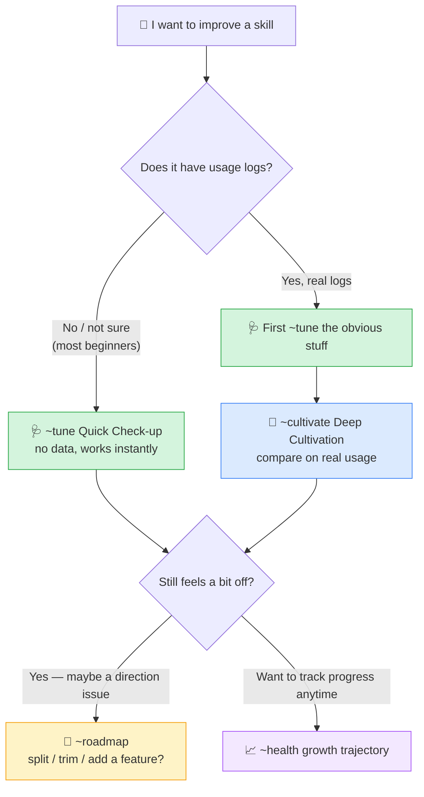

[简体中文](./README.md) · English

---


<p align="center">
  
  
  
  
</p>

# Skill Gardener

> A skill for improving your **other** skills. Like a gardener tending plants, it helps you grow your skills into better versions of themselves, little by little.
>
> **Works with both Claude Code and Codex.** ✅

---

## In one line: what is this?

If you've ever written or used a Claude "skill," you've probably hit one of these:

- A skill works, but it's **just a little off** — and you can't quite say why;
- You want to fix it, but **don't know where to start**;
- You change something, but **can't tell if it actually got better**.

**Skill Gardener is here for exactly these three problems.** Hand it a skill, and like an experienced craftsman it spots the flaws, fixes them, and shows you the skill getting better step by step.

> 💡 One line to remember: **other skills do your work; this skill takes care of your other skills.**

---

## How it helps — three levels, start with the easiest

A common flaw in similar tools: **they demand a big pile of "usage logs" before they'll do anything** — but beginners don't have that data, so they get stuck at the door.

This version (v2) splits it into three levels, and **the first one needs no data at all**:

| Level | Just say | Needs | What it does |
|---|---|---|---|
| 🩺 **Quick Check-up** (do this first) | `~tune my-skill` | **Nothing.** Zero setup | Reads your skill like a craftsman and fixes the obvious problems on the spot: weak trigger words, wrong file paths, outdated content, missing examples… **Most skills are noticeably better after just this step.** |
| 🔬 **Deep Cultivation** | `~cultivate my-skill` | Real usage logs | Generates several different fixes, compares them on your real usage, picks the genuinely better one, and guards against "it just got lucky" fake improvements. |
| 🧭 **Roadmap** | `~roadmap my-skill` | A bit of judgment | Doesn't touch details — helps you think about direction: should this skill be split in two? Is a feature outdated and should be removed? Is it missing a capability it should grow? |

Two more helpers:

- 📈 `~health my-skill` — see the skill's **growth trajectory**: started with 6 flaws, 5 are now fixed, here's the one left and what's next.
- 🪝 `~capture` — shows you how to **set up automatic logging in five minutes**, so usage data collects itself (getting you ready for Deep Cultivation).

---

## Which command should I use? This chart says it all



**Remember: not sure which one? Start with `~tune`. It's almost always the first step.**

---

## Getting started (three steps)

### Step 1: Install

Just drop the `skill-gardener` folder into your skills directory:

```bash
# Claude Code
cp -r skill-gardener ~/.claude/skills/

# Codex — same idea, put it in your skills directory
```

### Step 2: Call it

Open a new chat and just talk normally, e.g.:

```
take a look at my xxx skill, how is it written?
```

Or use the short command: `~tune xxx`

### Step 3: Follow along

It first gives you a **check-up report** (which flaws, how serious). After fixing, it shows you a **before/after** (what changed and why it's better). Once you're happy, it overwrites the original. It always works **on a copy**, so it never breaks your original skill.

> 🛡️ Don't worry: it won't change things behind your back. Every edit happens on a copy first, shown to you, and only applied after you say yes.

---

## Both Claude Code and Codex work ✅

Worth calling out, since many tools only support one:

- **Quick Check-up (`~tune`), Roadmap (`~roadmap`), Health (`~health`)** — work **exactly the same** on both, because they're reading/thinking/editing on their own, with no platform-specific dependency.
- **Deep Cultivation (`~cultivate`)** — on Claude Code it uses "several helpers competing in parallel"; on Codex it switches to "one at a time." **Same function**, just a speed difference.

So whichever you use, you can run the whole flow start to finish.

---

## What did this version (v2) fix?

The old version was elegantly designed but had a **fatal practical problem**: it assumed you already had a big pile of usage logs — which beginners don't. The result: it looked impressive but got **stuck at step one, with no felt sense of progress.**

This version fixes exactly that:

1. **Works with zero data** — the new Quick Check-up delivers value in one round, no data needed.
2. **Progress you can see** — the new growth trajectory shows flaws being crossed off one by one, instead of a hollow score.
3. **Data that actually accumulates** — a five-minute auto-logging setup, instead of "please keep a manual journal."
4. **Lower cost** — Deep Cultivation now defaults to a compute-saving mode, no more hundreds of calls by default.
5. **Helps you plan ahead** — the new Roadmap helps you decide whether a skill should be split, trimmed, or grown.

---

## What it does **NOT** do (honesty matters)

- **No single "85/100" score.** On purpose — one number hides real tradeoffs. It gives you "which flaws are fixed, which remain" — visible truth instead.
- **No optimizing out of thin air.** With no real data, Deep Cultivation honestly tells you "use Quick Check-up first" rather than pretending it validated anything.
- **No guarantee every round improves things.** Sometimes there's no better fix; it says so, instead of pushing a questionable change on you.
- **It's not magic.** The more real information you give it, the more precisely it can help.

---

## FAQ (for beginners)

<details>
<summary><b>I have zero usage logs — can I use it?</b></summary>

**Yes — and this is the biggest improvement in this version.** Use `~tune` Quick Check-up; it fixes obvious flaws with no data at all. Many problems (weak triggers, wrong paths, outdated content) don't need data to spot. Don't let "no data" stop you from doing anything.
</details>

<details>
<summary><b>Is it expensive or slow?</b></summary>

Quick Check-up, Roadmap, and Health are all light — just reading, thinking, editing. Only Deep Cultivation is heavier, and this version defaults to a compute-saving mode, so cost is already low. **A small tool doesn't need a heavyweight process.**
</details>

<details>
<summary><b>Will it break my skill?</b></summary>

No. Every change is made on a **copy** first, shown to you as "what changed and why," and only overwrites the original after you confirm. Don't like it? Toss it.
</details>

<details>
<summary><b>How is it different from "skill-creator"?</b></summary>

Simply: **skill-creator helps you *build* new skills from scratch; Skill Gardener helps you *tend* existing ones.** Building is building, tending is tending. Once you have a new skill and some usage data, hand it to the gardener to tend.
</details>

---

## What's in the folder?

```
skill-gardener/
├── SKILL.md                      # main flow (the gardener's brain)
├── README.md                     # 简体中文
├── README.en.md                  # this file (English)
└── references/                   # detailed manuals, loaded on demand
    ├── quick-review.md           # 🩺 how Quick Check-up works
    ├── log-capture.md            # 🪝 how data collects itself
    ├── health-card.md            # 📈 what the growth trajectory looks like
    ├── roadmap.md                # 🧭 how it helps you plan direction
    ├── skill-types.md            # skill categories and how they differ
    ├── failure-modes.md          # catalog of common flaws
    ├── candidate-strategies.md   # menu of improvement strategies
    ├── arena-protocol.md         # the comparison rules for Deep Cultivation
    └── anchor-system.md          # how aesthetic/creative skills are gated
```

---

## License

MIT. Use it, change it, freely.

---

<p align="center"><i>Skills are long-term assets. They don't need a one-afternoon makeover — they need patient, visible, gradual improvement.</i></p>
