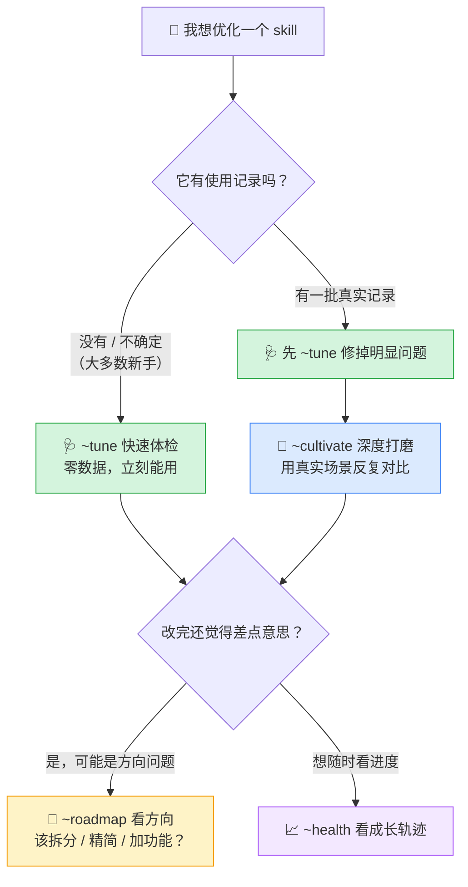

简体中文 · [English](./README.en.md)

---


<p align="center">
  
  
  
  
</p>

# Skill 园丁（Skill Gardener）

> 一个用来**优化你其它 skill** 的 skill。就像园丁照顾植物一样，帮你把手里的 skill 一点点养得更好用。
>
> **Claude Code 和 Codex 都能用。** ✅

---

## 一句话：这是什么？

如果你写过、或用过 Claude 的「skill」，你可能遇到过这些情况：

- 有个 skill 写好了，但用起来**总差点意思**，又说不上哪里不对；
- 想改，但**不知道从哪下手**；
- 改完了，也**不知道到底有没有变好**。

**Skill 园丁就是来帮你解决这三件事的。** 你把一个 skill 交给它，它像一位有经验的老师傅一样，帮你看出毛病、动手改好、并让你看到它一步步变好的过程。

> 💡 一句话记住它：**别的 skill 帮你干活，这个 skill 帮你把「别的 skill」养好。**

---

## 它怎么帮你？分三个档，从最省事的开始

很多同类工具有个通病：**非要你先攒一大堆「使用记录」才肯干活**——可新手根本没有这些数据，于是卡在门口，什么也做不了。

这一版（v2）把它拆成了三个档，**没有任何数据也能立刻用**：

| 档位 | 你说这句话 | 需要什么 | 它帮你做什么 |
|---|---|---|---|
| 🩺 **快速体检**（推荐先做） | `~tune 我的skill` | **啥都不用**，零门槛 | 像老师傅通读一遍，当场找出并修好明显的毛病：触发词不好、文件路径写错、内容过时、缺例子……**多数 skill 做完这一步就明显变好了。** |
| 🔬 **深度打磨** | `~cultivate 我的skill` | 需要真实使用记录 | 生成好几个改法，用你的真实使用场景反复对比，选出真正更好的那个，还会防止「只是碰巧」的假进步。 |
| 🧭 **看方向** | `~roadmap 我的skill` | 一点判断力 | 不改细节，帮你想大方向：这个 skill 是不是该拆成两个？某个功能是不是过时该删了？是不是缺一块能力该补上？ |

另外还有两个帮手：

- 📈 `~health 我的skill` —— 看这个 skill 的**成长轨迹**：一开始有 6 个毛病，现在治好了 5 个，还剩哪个、下一步干嘛，一目了然。
- 🪝 `~capture` —— 教你**五分钟配好自动记录**，让使用数据以后自己攒起来（为「深度打磨」做准备）。

---

## 该用哪个命令？看这张图就懂



**记住一句话：不确定用哪个？先 `~tune`。它几乎永远是第一步。**

---

## 怎么开始用（三步）

### 第 1 步：安装

把 `skill-gardener` 这个文件夹放进你的 skills 目录就行：

```bash
# Claude Code
cp -r skill-gardener ~/.claude/skills/

# Codex 同理，放进你的 skills 目录即可
```

### 第 2 步：叫它出来

新建一个对话，直接说人话就行，比如：

```
帮我看看我的 xxx skill 写得怎么样
```

或者用简短命令：`~tune xxx`

### 第 3 步：跟着它走

它会先给你一份**体检报告**（哪些毛病、严重不严重），改好后给你一份**前后对比**（改了什么、为什么更好）。你确认满意，再让它覆盖原文件。全程它都在**副本上改**，不会弄坏你的原 skill。

> 🛡️ 放心：它不会偷偷改你的东西。所有改动先在副本上做，给你看过、你点头了才生效。

---

## Claude Code 和 Codex，两个都能用 ✅

这一点特别说明一下，因为很多工具只支持一个：

- **快速体检（`~tune`）、看方向（`~roadmap`）、看成长（`~health`）** —— 两个平台**完全一样**好用，因为这些是它自己读、自己想、自己改，不依赖任何平台专属功能。
- **深度打磨（`~cultivate`）** —— 在 Claude Code 上会用「多个小助手并行比赛」的方式；在 Codex 上换成「一个一个轮流来」，**功能不变**，只是速度上的区别。

所以无论你用哪个，都能完整地把这套流程走下来。

---

## 这一版（v2）修好了什么？

老版本设计很漂亮，但有个**致命的实用问题**：它把「必须先有一大堆使用记录」当成前提，而新手根本没有——结果就是**看着很厉害，实际用起来卡在第一步，也感受不到进步**。

这一版针对性地解决了：

1. **零数据也能立刻用** —— 新增「快速体检」，不用攒数据，一轮就见效。
2. **让进步看得见** —— 新增「成长轨迹」，不是给你一个空洞的分数，而是让你看到毛病被一个个划掉。
3. **数据能真的攒起来** —— 新增五分钟就能配好的自动记录方法，不再是「请你手动记账」。
4. **成本降下来** —— 深度打磨默认用省算力的方式，不再动不动几百次调用。
5. **帮你想未来** —— 新增「看方向」，帮你决定 skill 该拆、该删、还是该长新功能。

---

## 它**不会**做的事（诚实很重要）

- **不会给你一个「85 分」这样的总分。** 这是故意的——一个数字会掩盖真实的取舍。它给你的是「哪些毛病治好了、还剩哪些」这种看得见的实话。
- **不会无中生有地「优化」。** 深度打磨没有真实数据时，它会老实告诉你「先去用快速体检」，而不是假装帮你验证过了。
- **不保证每次都能变得更好。** 有时候没有更好的改法，它会如实说，而不是硬塞一个可疑的改动给你。
- **它不是魔法。** 你给的信息越真实，它帮得越准。

---

## 常见问题（新手必看）

<details>
<summary><b>我一条使用记录都没有，能用吗？</b></summary>

**能，而且这正是这一版最大的改进。** 用 `~tune` 快速体检，零数据就能把明显的毛病修掉——很多问题（比如触发词不好、路径写错、内容过时）根本不需要数据就能看出来。别因为「没数据」就什么都不做。
</details>

<details>
<summary><b>会不会很贵、很慢？</b></summary>

快速体检、看方向、看成长都很轻，就是它读一读、想一想、改一改。只有「深度打磨」会重一些，而且这一版默认用了省算力的方式，成本已经降到很低。**小工具不需要上重型流程。**
</details>

<details>
<summary><b>它会把我的 skill 改坏吗？</b></summary>

不会。所有改动先在**副本**上做，给你看「改了什么、为什么」，你确认了才覆盖原文件。不满意随时可以不要。
</details>

<details>
<summary><b>它和「skill-creator」有什么区别？</b></summary>

简单说：**skill-creator 帮你从零「造」新 skill，Skill 园丁帮你「养」已有的 skill。** 造归造，养归养。你有了新 skill、用一段时间攒了数据，再交给园丁来养。
</details>

<details>
<summary><b>我英文不好，能用吗？</b></summary>

能。你全程说中文就行，它也用中文回你。
</details>

---

## 目录里都有啥？

```
skill-gardener/
├── SKILL.md                      # 主流程（园丁的大脑）
├── README.md                     # 本文件（中文）
├── README.en.md                  # English version
└── references/                   # 按需查阅的详细手册
    ├── quick-review.md           # 🩺 快速体检怎么做
    ├── log-capture.md            # 🪝 怎么让数据自己攒
    ├── health-card.md            # 📈 成长轨迹长什么样
    ├── roadmap.md                # 🧭 怎么帮你看方向
    ├── skill-types.md            # skill 分几类、怎么区别对待
    ├── failure-modes.md          # 常见毛病目录
    ├── candidate-strategies.md   # 改进办法菜单
    ├── arena-protocol.md         # 深度打磨的对比规则
    └── anchor-system.md          # 审美/创作类 skill 怎么把关
```

---

## 许可

MIT。随便用，随便改。

---

<p align="center"><i>Skill 是长期资产。它不需要一个下午的脱胎换骨，需要的是耐心的、看得见的、一点点的变好。</i></p>
